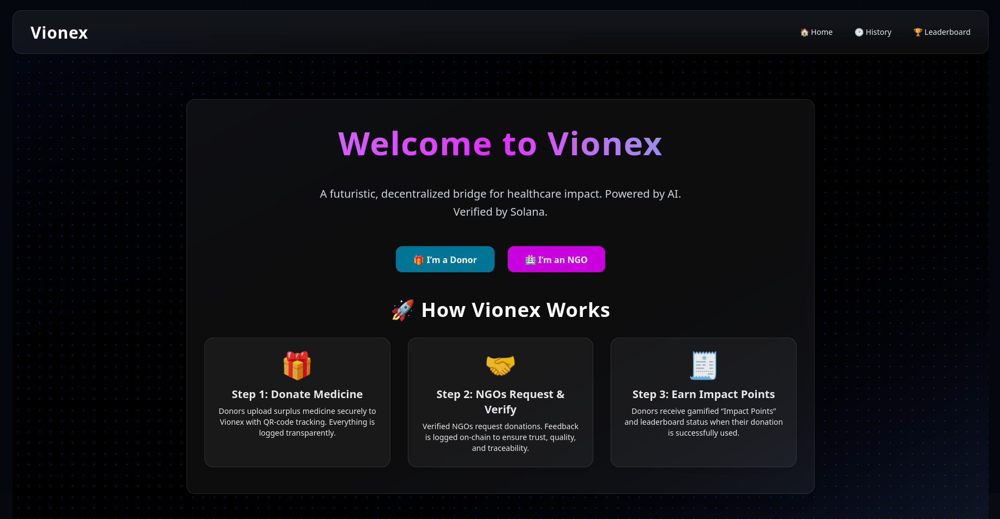

# Vionex

A **decentralized**, **AI-powered** platform bridging surplus and scarcity in healthcare.  
Donors contribute medicines, and NGOs request what they need - AI handles the matching, and Solana logs everything immutably.



---

## 📋 Table of Contents

- [Features](#-features)  
- [Tech Stack](#-tech-stack)  
- [Prerequisites](#-prerequisites)  
- [Getting Started](#-getting-started)  
  - [1. Clone the Repo](#1-clone-the-repo)  
  - [2. Configure Environment](#2-configure-environment)  
  - [3. Install Dependencies](#3-install-dependencies)  
  - [4. Firebase Setup](#4-firebase-setup)  
  - [5. Solana & Anchor Setup](#5-solana--anchor-setup)  
  - [6. Build & Deploy Anchor Program](#6-build--deploy-anchor-program)  
  - [7. Run Services](#7-run-services)  
- [Usage](#-usage)  
- [Project Structure](#-project-structure)  

---

## 🌟 Features

- **Donor Portal**
  - Email-based login
  - Add donations with QR-based handover
  - Auto-track donation delivery

- **NGO Portal**
  - Profile-based medicine requests
  - AI-recommended matches
  - Feedback & Solana on-chain logging

- **AI Matcher**
  - Flask microservice
  - Fraud scoring + smart match scoring

- **Solana Integration**
  - Anchor smart contract on Devnet
  - Borsh serialization
  - Transparent public transaction log

---

## 🛠️ Tech Stack

| Layer           | Technology                                   |
| --------------- | -------------------------------------------- |
| Frontend        | React · TailwindCSS · Vite · Framer Motion   |
| Backend         | Node.js · Express · Firebase Admin SDK       |
| Blockchain      | Solana Devnet · Anchor · web3.js             |
| Smart Contract  | Anchor (Rust)                                |
| AI Matcher      | Python · Flask · pandas                      |

---

## 📋 Prerequisites

- Node.js v16+
- Python 3.8+
- Solana CLI + Anchor CLI
- Firebase project (with Firestore + Service Account)
- jq (optional, for patching)

---

## 🚀 Getting Started

### 1. Clone the Repo

```bash
git clone https://github.com/suhasbm09/Vionex.git
cd Vionex
```
### 2. Configure Environment

Create backend/.env:
```bash
FIREBASE_SERVICE_ACCOUNT=./serviceAccountKey.json
SOLANA_KEYPAIR=./vionex-keypair.json
ANCHOR_PROGRAM_ID=<Your_Deployed_Anchor_Program_ID>
```
### 3. Install Dependencies

# Frontend
```bash
cd frontend
npm install
```

# Backend
```bash
cd ../backend
npm install
```

# AI Matcher
```bash
cd ../backend/ai_matcher
python -m venv .venv
source .venv/bin/activate
pip install -r requirements.txt
```

### 4. Firebase Setup

    Create Firebase project

    Add Firestore (Native mode)

    Generate service account JSON → save as backend/serviceAccountKey.json

### 5. Solana & Anchor Setup

# Install Solana
```bash
sh -c "$(curl -sSfL https://release.solana.com/v1.14.17/install)"
solana config set --url https://api.devnet.solana.com
```

# Install Anchor
```bash
cargo install --git https://github.com/coral-xyz/anchor --tag v0.28.0 anchor-cli --locked
```

### 6. Build & Deploy Anchor Program

```bash
cd solana/smart_contract
anchor build
anchor deploy --provider.cluster devnet
```
  > Copy the deployed program ID into backend/.env as ANCHOR_PROGRAM_ID.

### 7. Run Services

# AI Matcher (port 5001)
```bash
cd ai_matcher
source .venv/bin/activate
flask run --port 5001
```

# Backend (port 5000)
```bash
cd ../backend
node app.js
```

# Frontend (port 5173)
```bash
cd ../frontend
npm run dev
```

---
## 🎯 Usage

- 🧍 Donor Flow

    Go to / → "I’m a Donor"

    Setup profile → Add donation → QR code generated

    Wait for NGO to request → Confirm handover

- 🏥 NGO Flow

    Go to / → "I’m an NGO"

    Setup profile → AI suggestions appear

    Request → Confirm delivery → Give feedback

- 🔗 Blockchain Logs

    After feedback, view Solana Devnet logs via Solscan link

---

## 📂 Project Structure

```bash
Vionex/              
├─ backend/                  # Node.js + Firebase + Solana
│  └─ ai_matcher/            # Python Flask AI logic               
├─ frontend/                 # Vite + React + Tailwind frontend
├─ solana/
│  └─ smart_contract/        # Anchor smart contract
├─ .gitgnore
└─ README.md                 # You're here :)

```
---

## 🤝 Contributors

- [@suhasbm09](https://github.com/suhasbm09)  
- [@ishan-100](https://github.com/ishan-100)  
- [@jaswanth1797](https://github.com/jaswanth1797)  
- [@Rajatha-M-Deshmuk](https://github.com/Rajatha-M-Deshmuk)  
- [@Surajmanjunatha](https://github.com/Surajmanjunatha)  
- [@vymohith](https://github.com/vymohith)

---

## 📬 Contact

Feel free to connect or reach out for collaborations, improvements, or queries:  
📧 **suhasbm09@gmail.com**  
🌐 [github.com/suhasbm09/Vionex](https://github.com/suhasbm09/Vionex)

---

<p align="center">
  Built with 💡, AI ⚙️, and Solana 🔗 — to make impact traceable.
</p>


